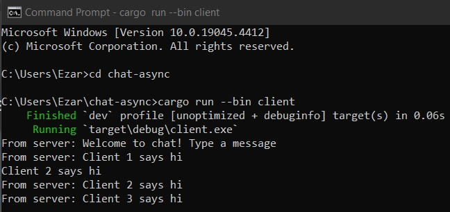
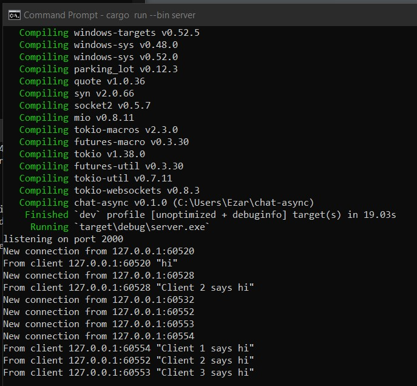

Mochammad Ezar Yudha 2206046746
<h1>Tutorial 10 (2)</h1>
<h2>Experiment 2.1: Original code, and how it runs</h2>
<h3>Client 1 Console</h3>

<h3>Client 2 Console</h3>

<h3>Client 3 Console</h3>

<h3>Server Console</h3>

The server handles multiple WebSocket connections concurrently and broadcasts messages received from clients to all connected clients. The client connects to the server, sends messages entered by the user, and prints out messages received from the server.